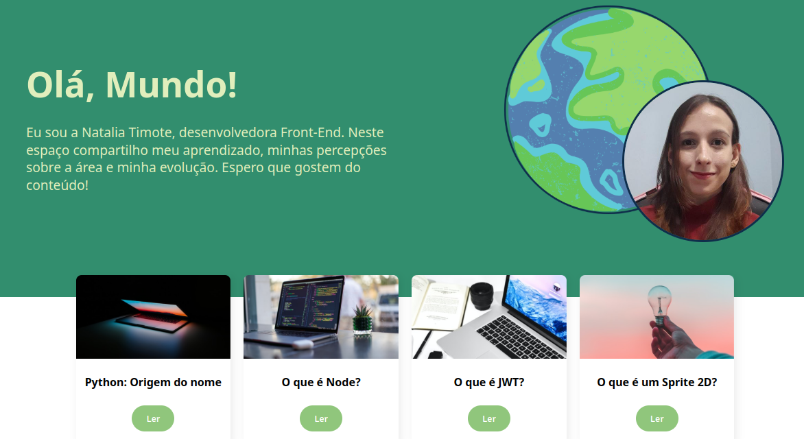
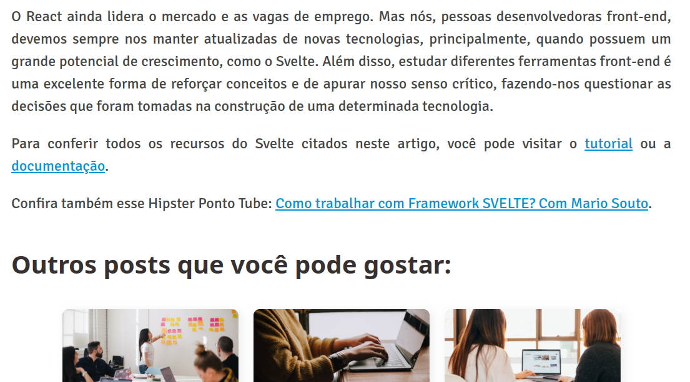
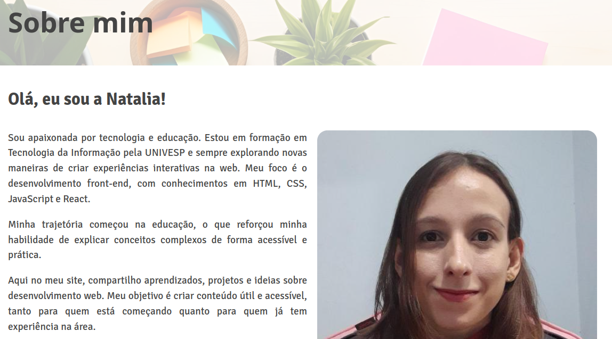

## 🌐 Hello, World!

O **Hello, World!** é uma aplicação simples de artigos sobre tecnologia, com uma interface que inclui uma página inicial, uma seção "Sobre mim" e a navegação entre os conteúdos. Criado a partir de um projeto base da Alura, este site foi customizado com minhas informações e conteúdos, e oferece uma experiência fluida de leitura por meio de uma SPA (Single Page Application) com **React Router**.

 

## 🚀 Sobre o Projeto

Este projeto foi desenvolvido durante o curso da Alura:

* "Curso de React: desenvolvendo em React Router com JavaScript"

A aplicação conta com uma navegação fluida entre páginas pelo uso de SPA, como o sobre mim, lista de artigos, e visualização de artigos específicos por meio de rotas dinâmicas.

## 📚 Objetivos do Curso

**👉 React: desenvolvendo em React Router com JavaScript**

* Conhecer a biblioteca **react-router-dom** e utilizar seus principais recursos;
* Aprender o que é e por que utilizar uma **SPA (Single Page Application)**;
* Resolver problemas utilizando **rotas aninhadas** e **rotas dinâmicas**;
* Explorar os **hooks do react-router-dom**, como useLocation e useParams;
* Implementar **desafios práticos**;
* **Personalizar** o projeto e publicar na Vercel.

## 🛠️ Tecnologias Utilizadas

                                        

## 🖼️ Visualização do Projeto

Uma prévia das principais funcionalidades do **Hello, World!**:

**🌐 Acesse o Projeto Online**

O projeto está disponível para visualização na **Vercel**. Clique no link abaixo para acessar:

**📄 Página de Artigos**

Lista de artigos disponíveis, com imagens, títulos e um botão para leitura.

**📘 Leitura de Artigos**

Ao clicar em "Ler", o usuário é levado a uma nova rota com o conteúdo completo do artigo.

**👩 Sobre Mim**

Seção dedicada à autora do site, com uma breve apresentação.

